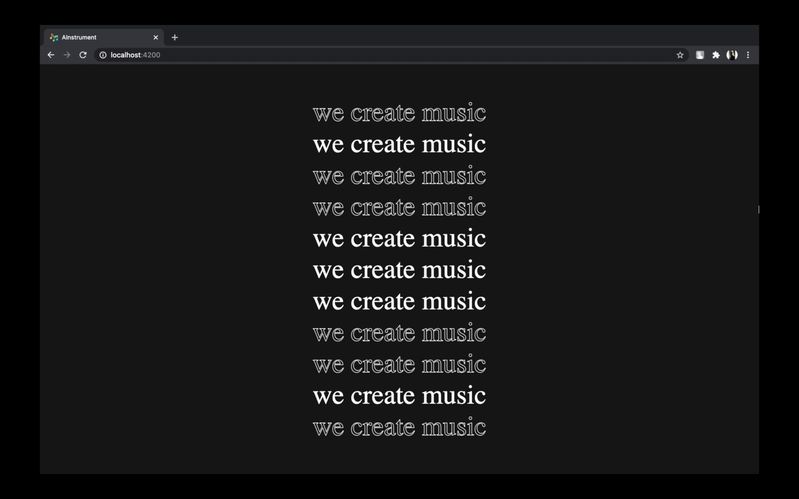

# AInstrument - A system for generating instrumental covers

- This project aims at filtering out the human vocals of songs using a library
  Spleeter, and turning them into instrumental versions, creating an ideal
  platform for young talented music enthusiasts to explore and learn to play
  various instruments. The vocals are converted to covers using the
  Differentiable Digital Signal Processing (DDSP) library, which enables
  direct integration of signal processing elements with deep learning
  techniques.

- Currently in the music industry, after recording original songs with
  lyrics, they are re-recorded for covers. AInstrument can also help music
  professionals and artists in turning existing songs to a particular instrumental
  cover to suit their need and also allows them to release various versions of
  their songs, without the burden of extra effort and money.

#### [View the live demonstration of the project](https://drive.google.com/file/d/1isO0YyhpWQGicfZpvnoXPC1HYOPN9DJP/view?usp=sharing)

### Technology Stack

1. Web Frontend developed using Angular

2. Backend developed using Flask

3. DDSP: Differentiable Digital Signal Processing

4. Data stored in Firebase

5. Spleeter

### Features

#### User

- User Authenication using Firebase
- Separation of the human vocals from the lyrical songs.
- Conversion of the song into various instrumental covers with differently tuned parameters to provide the end users with various options.
- Figuring out the notes from the converted instrumental cover.
- Very robust and high fidelity audio synthesis system.
- This system will remove the dependency of the instrument learning process of callow students on musicians.

## Screenshots

### System Architecture

### Landing

### Login

### Dashboard

### Profile

#### [View the Research paper here](https://www.ijraset.com/fileserve.php?FID=33953)
